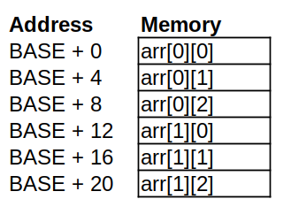

# Session 01: Introduction & Setup

## 01.1. Introduction

This article is adapted from the tutorial material for a Computer Science Course - CPSC355 and is meant to teach the basics of assembly, c and the inner working of a computer application.
The article will focus on understanding how a computer program is written and how that program is understood and executed by the processor. We will write assemble for the 64-bit ARMv8 architecture CPU. We will also understand what the binary code of a program written in C looks like. We will run the program in a Linux OS.

---
## 01.2. Setting up your ssh workspace

- Make sure you have your CPSC account set up. 
	- IT Account Management Portal [https://password.ucalgary.ca/](https://password.ucalgary.ca/)
- Make sure you have a ssh client installed on your computer.
	- Windows: [Putty Installation Instructions](https://www.ssh.com/academy/ssh/putty/windows/install)
	- linux/macOS: OpenSSH (Pre-Installed)
- Make sure you are using the university remote access VON if you are outside the unviersity network.
[Remote Access Instructions](https://ucalgary.service-now.com/it?id=kb_article&sys_id=52a169d6dbe5bc506ad32637059619cd)
- Connect to CPSC ARM server
	- Hostname: **arm.cpsc.ucalgary.ca**
	- Username: **Your_CPSC_Username**
	- Password: **Your_CPSC_Password**
	- On Windows: Open Putty > Enter Hostname: (john.sturgis@arm.cpsc.ucalgary.ca) > Open > Enter Password when prompted

---
## 01.3. Intro to the linux shell and VIM

- Basic Shell Commands
	```bash
	# This is a comment
	
	# 1. Print Directory Content
	ls

	# 2. Enter a Directory
	cd <Directory>

	# 3. Exit The current directory
	cd ..

	# 4. Crate a file
	touch <filename>

	# 5. Edit or create a file using vim
	vim <filename>

	# Clear the screen
	clear

	# Make a new directory
	mkdir <directory>

	# Delete a file
	rm <filename>

	# Delete a directory
	rm -r <directory>

	```

- VIM

	Operating modes in vim editor:

	- **Command Mode:** By default, command mode is on as soon as the vim editor is started. This command mode helps users to copy, paste, delete, or move text. We should be pressing [Esc] key to go to command mode when we are in other modes.
	- **Insert mode:** Whenever we try to open vim editor, it will go to command mode by default. To write the contents in the file, we must go to insert mode. Press ‘I’ to go to insert mode. If we want to go back to command mode, press the [Esc] key.

---
## 01.4. Compiling Your first C program

- Compiling a C program
	- Write your C program in a file with the extention `.c` (Not a requirement).
	- Enter the command to compile your C program into an `executable binary`
		```
		gcc codefile.c -o outfile.out
		```
	- Run the compiled binary.
		```
		./outfile.out
		```

---

## 01.5. Hello World in C
```c
#include <stdio.h>

int main() {
	printf("Hello World\n");
	return 0;
}
```

## 01.6. Exercise
Write a C program to convert celcius to fahrenheit

1. Get the current temperature in fahrenheit from the user
2. Convert it to celsius
3. Print the converted temperature

$$
C = \frac{(F - 32) * 5}{9}
$$

**Solution**
```c

```


# Session 02: C for Java Developers

## 02.1. What's the same? What's different?

- What's the same?
	- Values, Types (more or less), literals, expressions
	- Variables (more or less)
	- Conditionals: `if,switch`
	- Iteration: while, for, do-while, but not for-in-collection (“colon” syntax)
	- Call-return (methods in Java, functions in C): parameters/arguments return values
	- Arrays (with one big difference)
	- Primitive and reference types
	- Typecasts
	- Libraries that extend the core language (although the mechanisms differ somewhat)
- Whats Different
	- No classes or objects
	- Arrays are simpler
	- C-Strings are much more limited
	- No Collections
	- No garbage collection
	- Pointers !! (Memory addresses)


## 02.2. Data Types

- Primitive Types
	| java | C | 
	| --- | --- | 
	| int | int |
	| short | short |
	| long | long |
	| float | float |
	| double | double |
	| char | char |
	| byte | N/A |
	| boolean | N/A |

- Strings
	In C, strings are simply arrays of chars. That’s it. The following allocates a string that can hold 32 characters:
	```c
	char name[32];
	```
	You can use the string literal syntax to initialize a character array, and if you do, the C compiler is smart enough to figure out the length for itself
	```c
	char name[] = "George";
	```
	**C-strings are null terminated**


## 02.3. Input and Output

- **printf** - https://man7.org/linux/man-pages/man3/printf.3.html
	- Syntax: printf(char * format, ...variable_list)
	- format: A character string composed of zero or more ordinary chracters (not %) and format specifiers (starting with %).
	- variable_list: A list of values to replace in place of format specifiers according to the given format
	- Example: 
	```c
	int num = 2;
	printf("%d", num);

	float num2 = 3.1415926;
	printf("PI = %f", num2); 				// PI = 3.1415926
	printf("PI (2 decimal places) = %.2f", num2); 		// PI (2 decimal places) = 3.14

	char str[] = "Sheldon Cooper";
	printf("Name :: %s", str);				// Name :: Sheldon Cooper
	```

- **scanf** - https://man7.org/linux/man-pages/man3/scanf.3.html
	- Syntax: scanf(char *format, ...variable_pointers)
	- format: A character string composed of zero or more ordinary chracters (not %) and format specifiers (starting with %).
	- variable_pointers: Memory addresses of variables to store the input
	- Example:
	```c
	int num;
	print("Enter a number : ");
	scanf("%d", &num);

	char str[10];
	scanf("%9s", str);
	printf("Entered string : %s", str);
	```

- **getchar** - https://man7.org/linux/man-pages/man3/getchar.3p.html
	- get a byte from standard input stream
	- Example:
	```c
	#include <stdio.h>

	int main () {
		char c;

		printf("Enter character: ");
		c = getchar();

		printf("Character entered: ");
		putchar(c);

		return(0);
	}

	```

- **putchar** - https://man7.org/linux/man-pages/man3/putchar.3p.html
	- put a byte on the standard output stream
	- Example:
	```c
	#include <stdio.h>

	int main () {
		char ch;

		for(ch = 'A' ; ch <= 'Z' ; ch++) {
			putchar(ch);
		}

		return(0);
	}
	```
	
## 02.4. String utilities

- **strlen** - https://man7.org/linux/man-pages/man3/strlen.3.html
	- calculate the length of a string
- **strcpy** - https://man7.org/linux/man-pages/man3/strncpy.3.html
	- copy a string

- Example:
	```c
	char str[] = "Hello World";
	char str2[32];
	printf("String length = %d", strlen(str));
	strcpy(str2, str);
	printf("Copied string : %s", str2);
	```

## References
1. C for Java Programmers (George Ferguson) - https://www.cs.rochester.edu/u/ferguson/csc/c/c-for-java-programmers.pdf


# Session 03: Intro to Assembly & GDB

## 03.1. Writing and compiling an assembly program

- Save your assembly code with the file extension `.s`

- Compile the `.s` assembly code file to `.o` executable binary file.

  ```bash
  gcc code_file.s -o code_file.o -g
  ```
  - The `-g` flag tells gcc to add debug information to the binary executable. Use it when you plan to debug the created binary using **gdb**.


---
## 03.2. ARM Assembly Example

Proram to print hello world 10 times.

```assembly
# AARCH64 assembly tutorial example 01

		// Tell GCC to use printf function from outside this code
        .extern printf
fmt:
        .string "x19 = %d Hello World!\n"			// String to send to printf


		// Main function
        .balign 4						// Align instructions to word
        .global main					// Make main function visible to outside this code
main:
        stp     x29, x30, [sp, -16]!    // Save FP and LR to stack
        mov     x29, sp					// Update FP to current SP
		
		// Initialize loop counter
        mov     x19, #1;				// x19 starts from 1
loop_top:								// Loop starts here
        cmp     x19, #10				// Compare x19 to 10
        b.gt    loop_end				// If x19 > 10 then goto loop_end

		// Call printf external function
        ldr     x0, =fmt				// First argument is the pointer to format string
        mov     x1, x19					// Second argument is the integer to replace "%d"
        bl      printf					// Call printf

        add     x19, x19, #1			// Increment loop counter
        b       loop_top				// Repeat loop
loop_end:
        b       exit					// Goto Exit (Not needed here)

exit:
        // return 0
        mov x0, 0						// Return value 0 is stored in x0
        ldp x29, x30, [sp], 16			// Restore FP and LR from stack pointer
        ret								// Go back to the callee


```

---
## 03.3. Debugging using `gdb`

To open the program in `gdb`:
```bash
gdb my_asm.o
```

---
## 03.4. Useful `gdb` commands

Full command | Abbreviation | Description
--- | --- | ---
`break temp.c:28` | `b temp.c:28` | Set a breakpoint in the file `temp.c` at line 28
`break flabel_name` | `b label_name` | Set a breakpoint at the start of the `label_name` label. 
`run` | `r` | Start the program and run until the end of the program/the program crashes/the next breakpoint/the next watchpoint (if the program is already running, this command will tell the program to start from the beginning)
`continue` | `c` | Continue running until the end of the program/the program crashes/the next breakpoint/the next watchpoint
`next/nexti` | `n/ni` | Execute the current command, and move to the next command in the program. The `i` variant will execute a single instruction instead of a line. 
`step/stepi` | `s/si` | Step through the current command, but if this command is a function call, then go to the first line of that function. The `i` variant will execute a single instruction instead of a line. 
`print x` | `p x` | Print the value of the register `x`. 
`print/x x` | `p/x x` | Print the value of the register `x` in hexadecimal 
 `x addr`             |                | Inspect memory at address (Prints 32 bytes hex value by default) 
`x/s addr` |  | Print the string starting at `addr` and ending with a `\0` 
`info breakpoints` | `i b` | Display information about all declared breakpoints
`info registers` | `i r` | List all registers and their values. 
info registers x19 | i r x19 | Print the value of regsiter x19 
`delete breakpoints` | `delete` | Delete all breakpoints that have been set
`clear label_name` | | Deletes the breakpoint set on `label_name` 
`quit` | `q` | Exit `gdb`


# Session 04: Control Flow in Assembly

## 04.1. Define and Macros
- The **define** statement can create alternate name for registers.
	```assembly
	// This will tell the assembler to replace all x_r to x19
	define(x_r, x19)
	```
- The commands `.macro` and `.endm` allow you to define macros that generate assembly output. For example, this definition specifies a macro sum that puts a sequence of numbers into memory:
	```assembly
        .macro  increment reg
	add	\reg, \reg, 1
        .endm
	```

---
## 04.2. Branch Instruction and Condition Codes

- Conditional branch statements use the condition falgs to make a decision.
- These condition flags are set or unset depending on the result of a compare instruction. i.e. `cmp`

Example:
```assembly
cmp	x19, x20
b.eq	some_label
```

The `cmp` instruction compares the values of two registers or a register and a value and the `b.eq` instruction jumps to `some_label` if the compared values were equal.

Other branching instructions:
- b.eq (==)
- b.ne (!=)
- b.gt (>)
- b.lt (<)
- b.ge (>=)
- b.le (<=)


---
## 04.3. Loops

- **do-while** loop (post-test loop)
	- Example:
	C Code:
	```c
	long int x;
	
	x = 1;
	do {
		// Loop body
		x++;
	} while(x <= 10);
	```
	Equivalent Assembly Code:
	```assembly
		mov	x19, 1
	top:	// Loop Body
		// ...
		
		add	x19, x19, 1
		cmp	x19, 10
		b.le	top
	```

- **while** loop (pre-test loop)
	- Example
	C Code:
	```c
	long int x;
	x = 0;
	while (x<10) {
		// Loop body
		x++;
	}
	```
	Equivalent Assembly Code
	```assembly
	define(x_r, x19)
		
		mov	x_r, 0
		b	test
	top:	// Loop Body
		// ...
		
		add	x_r, x_r, 1
	test:	cmp	x_r, 10
		b.lt	top
		
		// Loop Finished				
	```


---
## 04.4. The if construct

- Formed by branching over the statement body if the condition is not true.
	Example:
	
	```c
	if (a > b) {
	  c = a+b;
	  d = c+5;
	}
	```
	
	Equivalent Assembly Code:
	
	```assembly
	define(a_r, x19)
	define(b_r, x19)
	define(c_r, x19)
	define(d_r, x19)
	
		...
		cmp		a_r, b_r	// test
		b.le	next			// Logical compliment
		add		c_r, a_r, b_r
		add		d_r, c_r, 5
	next:
		// Statements after if condition
	```

- The **if-else** construct is formed by brnaching to the else part if the condition is not true.

  Example C Code:

  ```c
  if (a>b) {
    a = a+b;
  } else {
    a = a-b;
  }
  ```

  Equivalent Assembly Code:

  ```assembly
  define(a_r, x19)
  define(b_r, x20)
  
  	cmp		a_r, b_r
  	b.le	else
  	
  	add		a_r, a_r, b_r
  	b			next
  	
  else:
  	sub		a_r, a_r, b_r
  	
  next:
  	// Statements after the if-else construct
  ```


  


# Session 05: Revise & Practice


# Session 06: Bitwise and Shift Instructions

## 06.1.  Bitwise Instructions

In computer programming, a bitwise operation operates on a binary number at the level of its individual bits. (A bit-by-bit operation)

- Binary OR, | shorthand
	```
	   0101 (decimal 5)
	OR 0011 (decimal 3)
	 = 0111 (decimal 7)
	```
	
- Binary AND, & shorthand
  ```
      0110 (decimal 6)
  AND 1011 (decimal 11)
    = 0010 (decimal 2)
  ```

- Binary NOT, ~ shorthand
  ```
  NOT 0111  (decimal 7)
    = 1000  (decimal 8)
  ```

- Binary XOR, ^ shorthand
  ```
      0101 (decimal 5)
  XOR 0011 (decimal 3)
    = 0110 (decimal 6)
  ```

### ARMv8 bitwise commands

- Or: ORR
- And: AND
- Xor: EOR
- Not: MVN (move and not)


**Example**

```assembly
// Load Registers
mov		x19, 0b0101
mov		x20, 0b0011

// Perform bitwise Operations
orr		x0, x19, x20
and		x0, x19, x20
eor		x0, x19, x20
mvn		x0, x19, x20
```

---
## 06.2.  Shift Instructions

- Left Shift
	```
	    0101 << 1
	  = 1010
	```
- Right Shift]
	```
	    0101 >> 1
	  = 0010
	```

**Arithmetic Shift** Preserves the sign bit (Leftmost bit). i.e. it does not move the leftmost bit

### ARMv8 Shift instruction

- Logical Shift Left: LSL
- Logical Shift Right: LSR
- Arithmetic Shift Right: ASR

**Example**

```assembly
// Load Registers
mov		x19, 0b0101
mov		x20, 0b0011

// Perform bitwise Operations
lsl		x0, x19, 1
lsr		x0, x19, 1
asr		x0, x19, 1
```


# Session 07, 08: Revise & Practice


# Session 09: Stack Memory

## 09.1. Memory Organisation


- **Global Variables** declared outside functions/methods are placed directly after each other starting at the beginning of RAM.
- **Local (automatic) variables** declared in functions and methods are stored in the **stack**.
- Variables allocated dynamically (vie the **malloc()** function or the **new()** operator) are stored in the **heap**.


---

## 09.2. Stack Memory


1. Frame Pointer (FP/x29) points to the starting address of the current stack frame. It is set once at the beginning of the function and does not change through the function. 
2. Link Register (LR/x30) points to the instruction from where a function was called. It is set when using the **bl** instruction. It is used to go back to the calling function after return.
3. Stack Pointer (sp) points to the starting address of the stack which included temporary variables declared during the function. The sp register is decremented as variables are created and it is incremented as local variables go out of scope.

#### Making a function

1. Move the stack pointer back to make room for local variables and calling function's FP & LR. 
   `[sp, -16]!`
2. Store Calling functions FP & LR at the starting of stack (SP).
   `stp	x29, x30, [sp, -16]!`
3. Store the new SP value to current FP.
   `mov	x29, sp`
4. Function body ....
5. Load calling functions FP & LR from the starting of stack (SP) to x29, x30
   `ldp	x29, x30, [sp]`
6. Increment SP to the original position.
   `ldp	x29, x30, [sp]`
7. Return


---

## 09.3. Local Variables

Local variables are stored in the same manner as calling function's FP and LR are stored.


C Code:

```c
int main() {
    int a=10;
    printf("Value of a = %d \n", a);
    return 0;
}
```

Equivalent Assembly Code:

```assembly
fmt:
	.string	"Value of a = %d \n"


a_s = 16							// Start of a
alloc = -(16+4) & -16				// Bytes to alloc (negative number will be added to decrement SP)

	.global main
	.balign 4
main:
	stp		x29, x30, [sp, alloc]!	// Increment SP by -(16+4) & -16
	mov		x29, sp					// Set current FP to new SP
	
	// int a = 10;
	mov 	w19, 10					// Store 10 temporarily in w19
	str		w19, [x29, a_s]			// Load 10 at (sp + 16)
	
	// printf("%d", a);
	ldr		x0, =fmt				// First arg = address of format string
	ldr		w1, [x29, a_s]			// Second arg = value stored at (sp + 16)
	bl		printf					// Call printf
	
exit:
	mov		x0, 0					// Set return value 0
	ldp		x29, x30, [sp], -alloc	// Restore Values from (sp) to x29 and (sp+8) to x30. Restore SP
	ret
```

---

## 09.4. GDB Inspect Memory (x command)


The x command in GDB is used to view the content of RAM at a specific address. It has 3 modes.

1. `x [Address]` 
2. `x/[Format] [Address]`
3. `x/[Length][Format] [Address]`


Example:

1. `x/g $sp`
   View the 8 bytes of memory at address stored in stack pointer (Top of stack).
2. x/10g $sp
   View 8 bytes of memory 10 times starting from address stored in SP.
3. x/dw $fp+16
   View 4 bytes (w) of memory in decimal (d) at 16 bytes ahead of Frame Pointer ($fp+16)


# Session 10: Revise & Practice


# Session 11: Stack Memory - Arrays

## 11.1. Allocating arrays in the stack


### What are Arrays?

Arrays are ordered collections of data elements of the same type that are contiguously stored in memory.


### Accessing Array Items

To get the address of item in an array from index i. Add the **offset** of the item to the **base address**.

Base Address : Address of the first byte of the array.

Offset: (index * item_size) The distance in bytes of the item from the base address.

**Address of arr[i] = Base + (i * item_size)**

Example:

1. Address of Element 0 = Base + (0 * 4) = Base + 0
2. Address of Element 1 = Base + (1 * 4) = Base + 4
3. Address of Element 2 = Base + (2 * 4) = Base + 8
4. Address of Element 3 = Base + (3 * 4) = Base + 12
5. Address of Element 4 = Base + (4 * 4) = Base + 16


### Storing Array in the stack

Arrays are stored like local variables on the stack with a large size.

**Size of the array = Number of items * item_size**


Example C:

```c
#define ARR_ITEMS 10

int main() {
    int var;
	int arr[ARR_ITEMS];
    
	var = 3456;
	arr[0] = 1234;
}
```


Example Assembly:

```assembly
arr_items = 10
var_size = 4
alloc = -(16 + var_size + arr_items*4) & -16

		.global main
		.balign 4
main:	stp		x29, x30, [sp, alloc]!
		mov		x29, sp
		
        mov		w19, 3456
        str		w19, [x29, 16]
        
		mov		w19, 1234
		str		w19, [x29, 20]
		
exit:	mov		x0, 0
		ldp		x29, x30, [sp], -alloc
		ret
```


## 11.2. Loading & Storing Array Items


Array items can be loaded and stored in the RAM just like any other variable using the **ldr** and **str** instructions.

For getting the address of item we can use the offset = (index * item_size):

```assembly
define(base_r, x19)
define(index_r, x20)
define(offset_r, x21)

# Calculate Base Address
add		base_r, x29, arr_s

# Caclculate offset using mul
mul		offset_r, index_r, 4
# Or Calculate offset using LSL (efficient)
lsl		offset_r, index_r, 2

# Store w21 to arr[i]
str		w21, [base_r, offset_r]
```

*Note: Shift left by 2 is equivalent to multiplying by 4.*


Offset can also be calculated using the "**Register with scaled register offset**" addressing mode

`ldr val_r, [base_r, index_r, LSL 2]   ; val_r = *(base_r + (index_r << 2))`

For preserving sign in the index_r when shifting left, use the **SXTW** instead of **LSL**

`ldr val_r, [base_r, index_r, SXTW 2]   ; val_r = *(base_r + (index_r << 2))`


Optimised Array Addressing:

```assembly
define(base_r, x19)
define(index_r, x20)

# Calculate Base Address
add		base_r, x29, arr_s

# Storing w21 -> arr[index]
str		w21, [base_r, index_r, SXTW 2]
# Loading w21 <- arr[index]
ldr		w21, [base_r, index_r, SXTW 2]
```


### Exercise

Write a program in arm assembly to find the maximum item of an array. The array is initialised using the rand function.

C Code:

```c
#include <stdio.h>
#include <stdlib.h>

#define ARR_ITEMS 10

int main() {
    int arr[ARR_ITEMS];
    int i;
    int max;
    
    for (i=0; i<ARR_ITEMS; i++) {
        arr[i] = rand() & 0xFF;
    }
    
    max = arr[0];
    for (i=0; i<ARR_ITEMS; i++) {
        if (arr[i] > max) {
            max = arr[i];
        }
    }
    
    printf("Maximum item is %d\n", max);
    
    return 0;
}
```


# Session 12: Revise & Practice


# Session 13: Structures and Subroutines

## 13.1. Multidimensional Arrays

Most languages use row major order when storing arrays in RAM.

**Row Major Order**: In row-major layout, the first row of the matrix is placed in contiguous memory, then the second, and so on:


Offset of (r,c) = (r * NCOLS + c) * ITEM_SIZE

Where NCOLS is the number of columns per row in the matrix. It's easy to see this equation fits the linear layout in the diagram shown above.


`int arr[2][3]` (Multidimensional array with 2 rows and 3 columns)




Example:

```c
int main() {
	int arr[2][3];
	register int i,j;
	...
	arr[i][j] = 13;
	...
}
```

Assembly:

```assembly
define(arr_base_r, x19)
define(offset_r, w20)
define(i_r, w21)
define(j_r, w22)

...
	rows = 2
	cols = 3
	arr_size = rows * cols * 4
	alloc = -(16 + arr_size) & -16
	arr_s = 16

main:
	stp	x29, x30, [sp, alloc]!
	mov	x29, sp
	
	...
	add	arr_base_r, x29, arr_s				// Caculate arr base address
	mul	offset_r, i_r, cols				// offset = (i * NCOLS)
	add	offset_r, offset_r, j_r				// offset = (i * NCOLS) + j
	
	mov	w24, 13						
	str	w24, [arr_base_r, offset_r, SXTW 2]
		
		
```

---

## 13.2. Data Structures

Contains fields of different types. Each field is accessed using an offset from the base address of the struct.

Example:

```c
struct rec {
	int a;
	char b;
	short c;
}

             Base of rec
             |
             V
---+---+---+---+---+---+---+---+---+---+---+---+---
   |   |   | a | a | a | a | b | c | c |   |   |   
---+---+---+---+---+---+---+---+---+---+---+---+---
             ^               ^   ^                     
             |               |   |                   
Offsets:     a:0             b:4 c:5           

```

```assembly

// Offsets
rec_a = 0
rec_b = 4
rec_c = 5

// Access fields of struct pointed by x19
ldr	w20, [x19, rec_a]
ldsb	w21, [x19, rec_b]
ldrsq	w22, [x19, rec_c]
```

---

## 13.3. Subroutines

Subroutines allow us to repeat a set of instructions using different arguments

**Open Subroutine** : Code is inserted (duplicated) wherever the subroutine is invoked.


**Closed Subroutines** : Machine code is not copied, the cpu jumps to the single place where the code is in the RAM and returns back to the calling place once the subroutine is over.


## 4. Open Subroutines

Open subroutines are usually implemented using a macros (M4). 

M4 macros are created using define and arguments are accessed within the macro using $1, $2 ...

> Note: Use `' instead of '' or "" to create multiline macros

Example:
```assembly
// Macro to increment a register by 1

define(increment, `
	add	$1, $1, 1
')


	...
	increment(x19)		// Calling macro
	
	// Expands to
	add	x19, x19, 1
	...
```

Example:
```assembly
// Macro to print array of integers

fmt_int32:	.string	"%d \n"

define(print_int32, `
	ldr	x0, =fmt_int32
	mov	w1, $1
	bl	printf
')

	...
	print_int32(w19)

	// Expands to
	ldr	x0, =fmt_int32
	mov	w1, w19
	bl	printf
	
	...

```


# Session 14: Closed Subroutines

## 14.1. Closed Subroutines

Closed subroutines do not rely on macros. They are placed outside the main or any other subroutine.

Building a closed subroutine :

```assembly
label:		stp	x29, x30, [sp, alloc]!
                mov	x29, sp

                // Body of Subroutine
                ....

                ldp	x29, x30, [sp], -alloc
                ret
```

- **label**: Name of the subroutine. Used with bl instruction
- **alloc**: Assembler equate denoting the size in bytes to allocate in the stack frame.

### Invoking Closed Subroutine

Closed subrotuines are are invoked using the branch and linking `bl` instruction (Subroutine Linkage). 

```assembly
                bl	label
```


1. The bl instruction stores the return address (PC+4) in link register (x30) and changes the sp to the label. 
2. The CPU then starts execution from the updated program counter (PC)
3. The ret instruction loads address from LR (x30) back into PC.

Example:
```c

void printHello() {
        printf("Hello ");
}

void printWorld() {
        printf("World \n");
}

void printMessage() {
        printHello();
        printWorld();
}

int main() {
        printMessage();
        return 0;
}

```

**Equivalent Assembly Code**
```assembly

str_hello:	.string	"Hello "
str_world:	.string	"World \n"

                .global main
                .balign 4

printHello:	stp	x29, x30, [sp, -16]!
                mov	x29, sp

                ldr	x0, =str_hello
                bl	printf
                
                ldp	x29, x30, [sp], 16
                ret

printWorld:	stp	x29, x30, [sp, -16]!
                mov	x29, sp

                ldr	x0, =str_world
                bl	printf
                
                ldp	x29, x30, [sp], 16
                ret

// printMessage Function
printMessage:	stp	x29, x30, [sp, -16]!
                mov	x29, sp

                bl	printHello
                bl	printWorld
                
                ldp	x29, x30, [sp], 16
                ret
                
// Main function
main:		stp	x29, x30, [sp, -16]!
                mov	x29, sp
        
                bl	printMessage
        
                mov	x0, 0
                ldp	x29, x30, [sp], 16
                ret
```

When the first printf is invoked the stack would look like this:
```


               |                |                           
               |                |                           
 x29 --------> |================|    
           +---| Prev FP        | <---- printf
           |   | -------------- |                           
           |   | Prev LR        |                           
           |   | -------------- |                           
           |   | local vars     |                        
           +-->|================|                           
         +-----| Prev FP        | <---- printHello  
         |     | -------------- |                           
         |     | Prev LR        |                           
         +---->|================|                           
           +---| Prev FP        | <---- printMessage        
           |   | -------------- |                           
           |   | Prev LR        |                          
           +-->|================|                           
         +-----| Prev FP        | <---- main                
         |     | -------------- |                           
         |     | Prev LR        |                           
         |     |================|                             
         +---->|                |                             
               |       .        |                             
               |       .        |                             
               |       .        |                             
               |                |                             
               
```

### Arguments and Return Values to closed subroutines

- **Arguments are passed using x0-x7 registers**
- **Single Return value is stored in x0 register**

To pass in parameters to a subroutine, we generally use w0-w7 or x0-x7. It is possible to return multiple values as well by storing the return values in w0-w7 or x0-x7. The reason is simple: there is only one set of registers, and they are considered global. If a subroutine stores values in w0-w7, they will still be available to the calling code once the subroutine returns. Note that this is not true for all registers, and that w0-w7 are specificly used for passing parameters to/from subroutines.

Example: Program to calculate integer exponent using a function

C Code:
```c
#include <stdio.h>

int power(int base, int exp) {
        register int result = 1;
        while(exp > 0) {
                result = result * base;
                exp--;
        }
        return result;
}

int main() {
        int r;

        r = power(5, 3);

        printf("Result : %d \n", r);
        return 0;
}
```

Equivalent Assembly Code in `ex2.asm`

### Pointer Arguments

As we know pointers are just memory address so they will be stored in 64 bit registers (x0-x7) instead of 32 bit registers. 

It implies that the variable value is in ram at the address stored in the argument.

Example: Program to swap 2 numbers using pointers passed to functions

C Code:
```c

void swap(int *x, int *y) {
        register int temp;
        temp = *x;
        *x = *y;
        *y = temp;
}

int main() {
        int a = 5, b = 7;
        printf("a = %d, b = %d", a, b);
        swap(&a, &b);
        printf("a = %d, b = %d", a, b);
        return 0;
}
```

Equivalent Assembly Code in `ex3.asm`

---

## 14.2. Exercise

### Change Example 2 to take base and exponent from the terminal, using the scanf function

```c
#include <stdio.h>

int power(int base, int exp) {
        register int result = 1;
        while(exp > 0) {
                result = result * base;
                exp--;
        }
        return result;
}

int main() {
        int b, e, r;
        // Use scanf to get users input
        scanf("%d", &b);
        scanf("%d", &e);
        r = power(b, e);

        printf("Result : %d \n", r);
        return 0;
}
```


# Session 15: Subroutine arguments and returned values

## 15.1. Passing/Returning Struct Value

Structs are mostly bigger than 8 bytes. Hence, they cannot be passed/returned in registers (x0-x7).

**Returning struct value**

- The calling code allocates, the memory for the returned struct in it's stack and stores the address of the allocated struct in **x8**. 
- The invoked function then modifies the struct at the memory pointed by x8.

Example:
C Code
```c
struct color {
        int r;
        int g;
        int b;
}

struct color black() {
        struct color newcol;
        newcol.r = 0;
        newcol.g = 0;
        newcol.b = 0;
        return newcol;
}

int main() {
        struct color col;
        col = black();
        printf("Color( r=%d, g=%d, b=%d )\n", col.r, col.g, col.b)
        return 0;
}
```

Equivalent Assembly Code:
```asssembly
str_fmt:.string "Color( r=%d, g=%d, b=%d )\n"

	.global main
	.balign 4

        // Define constants for struct col
        color_size = 12
        color_r_s = 0
        color_g_s = 4
        color_b_s = 8


        define(col_base_r, x21)
        main_alloc = -(16 + color_size) & -16
        col_s = 16
main:	stp	x29, x30, [sp, main_alloc]!
	mov	x29, sp
	
        // Store address of col in x8
	add     x8, x29, col_s
        bl      black

        add     col_base_r, x29, col_s
        ldr     x0, =str_fmt
        ldr     w1, [col_base_r, color_r_s]
        ldr     w2, [col_base_r, color_g_s]
        ldr     w3, [col_base_r, color_b_s]
        bl      printf
	
        mov	x0, 0
	ldp	x29, x30, [sp], -main_alloc
	ret


define(newcol_base_r, x21)

        black_alloc = -(16 + color_size) & -16
        newcol_s = 16
black:	stp	x29, x30, [sp, black_alloc]!
	mov	x29, sp
	
        // Calculate local struct base
        add     newcol_base_r, x29, newcol_s
        
        str     wzr, [newcol_base_r, color_r_s]
        str     wzr, [newcol_base_r, color_g_s]
        str     wzr, [newcol_base_r, color_b_s]

        // Copy local struct to struct at [x8]
        ldr     w19, [newcol_base_r, color_r_s]
        str     w19, [x8, color_r_s]
        ldr     w19, [newcol_base_r, color_g_s]
        str     w19, [x8, color_g_s]
        ldr     w19, [newcol_base_r, color_b_s]
        str     w19, [x8, color_b_s]
	
        ldp	x29, x30, [sp], -black_alloc
	ret
```
**Passing struct value**

Passing struct by value is done using the same method as returning struct by value.
The address of the local variable to pass is stored in x0-x7. The subroutine then copies the struct to its stack from x0-x7.

**Example 2**: ex2.c, ex2.asm - Program to lighten color passed as value and return new color

---

## 15.2. Passing/Returning Struct Pointer

Passing by value is not very efficient, since the whole struct is copied before passing or returning. But it also makes sure that the original struct is not modified.

But sometimes, we might need to modify the original struct passed to the subroutine or we might neeed to just read the struct. In such cases, we do not need to allocate the struct in the subroutine's stack frame. Instead, we can pass the base address of the struct (pointer) and directly modify the memory at the address passed.

Example 3: ex3.c, ex3.asm - Modify example 2 lighten function to modify the original color passed instead of creating a new color.


# Session 16: Revise & Practice


# Session 17: External Pointer Arrays

## 17.1. External Pointers

**Pointers** are variables which store the address of another variable in memory.

Example:
```c
void increment(int *ptr) {
    *ptr = *ptr + 1;
}

int main() {
    int i = 5;
    int *ptr_i = &i;

    printf("i = %d\n", i);
    increment(ptr_i);
    printf("i = %d\n", i);

    return 0;
}
```

**External Pointers** are pointers which point to a variable not in the stack memory.

Example: a string literal is defined outside the stack. We just pass the address of the string to printf.

Example:
```c
int main() {
        // String literals are not stored in the stack.
        char *msg1 = "Hello ";
        char *msg2 = "World!\n";
        
        // First argument to printf is a pointer to a string (char *)
        printf(msg1);
        printf(msg2);
}
```

Example:
```assembly
msg1:   .string "Hello "
msg2:   .string "World!\n"


        .global main
        .balign 4

        
        ptr_size = 8
        alloc = -(16 + ptr_size + ptr_size) & -16
        msg1_s = 16
        msg2_s = 24

main:	stp	x29, x30, [sp, -16]!
        mov	x29, sp
        
        // char *msg1 = "Hello ";
        ldr     x21, =msg1
        str     x21, [x29, msg1_s]

        // char *msg2 = "World!\n";
        ldr     x21, =msg2
        str     x21, [x29, msg2_s]

        // printf(msg1);
        ldr     x0, [x29, msg1_s]
        bl      printf

        // printf(msg2);
        ldr     x0, [x29, msg2_s]
        bl      printf

exit:	mov	x0, 0
        ldp	x29, x30, [sp], 16
        ret

```

## 17.2. External Pointer Arrays

External Pointer arrays are several pointers (address to variables in external memory) stored sequentially.

### Defining external pointer arrays
```assembly
arr_label:      .dword  ptr1    ptr2    ptr3    ...
```

Example:
```assembly
str_jan:        .string "January"
str_feb:        .string "February"
str_mar:        .string "March"
str_apr:        .string "April"
str_may:        .string "May"
str_jun:        .string "June"
str_jul:        .string "July"
str_aug:        .string "August"
str_sep:        .string "September"
str_oct:        .string "October"
str_nov:        .string "November"
str_dec:        .string "December"

...

months:         .dword  str_jan, str_feb, str_mar, str_apr, str_may, str_jun, str_jul, str_aug, str_sep, str_oct, str_nov, str_dec

...
```

### Accessing value inside external pointer arrays

Values inside external arrays are accessed using the same method as any other array:

> `address of i-th item = BASE_ADDRESS + INDEX * SIZE`

For accessing values inside external pointer arrays SIZE = 8 bytes

> `address of i-th item = BASE_ADDRESS + INDEX * 8`

Example:

```assembly
define(base_r, x20)
define(index_r, x21)

ldr     base_r, =months
ldr     x21, [base_r, index_r, SXTW 3]
```

Note: We are using SXTW 3 since size of items inside array is 8 (2^3)

## Data sections

1. **.text** section is read only pre-initialized memory. It stores read only strings and assembly code.
2. **.data** section is read-write pre-initialized memory. It stores global variables. Data section should be doubleword aligned.

Example:
```assembly
// Store string literals in .text
                .text
str_fmt:        .string "months[%d] = %s\n"

str_jan:        .string "January"
str_feb:        .string "February"
str_mar:        .string "March"
str_apr:        .string "April"
str_may:        .string "May"
str_jun:        .string "June"
str_jul:        .string "July"
str_aug:        .string "August"
str_sep:        .string "September"
str_oct:        .string "October"
str_nov:        .string "November"
str_dec:        .string "December"

// Store global variables (pointer array) in .data section.
                .data
                .balign 8
months:         .dword  str_jan, str_feb , str_mar, str_apr, str_may, str_jun, str_jul, str_aug, str_sep, str_oct, str_nov, str_dec

// Store Code in .text section
                .text
                .balign 4
                .global main
main:           stp	x29, x30, [sp, -16]!
                mov	x29, sp

                mov     w19, 0
loop_top:       cmp     w19, 12
                b.ge    loop_end

                // printf("months[%d] = %s\n", w19, months[w19])
                ldr     x0, =str_fmt
                mov     w1, w19
                ldr     x20, =months
                ldr     x2, [x20, w19, SXTW 3]
                bl      printf

                add     w19, w19, 1
                b       loop_top
loop_end:       
                
exit:	        mov     x0, 0
                ldp	x29, x30, [sp], 16
                ret
```


# Session 18: Global Variables and Linking

## 18.1. Using .data and .bss section to store global variables


### Global Variables

Global variables are variables which 
- have a fixed place in memory 
- they exist throughout the lifetime of the process
- they can be accessed from any function (globally)

In C, any variable defined outside the functions is a global variable.

Example (c):
```c
#include <stdio.h>

int num = 10;

void printNum1() {
        printf("num1 = %d\n", num);
        num++;
}

void printNum2() {
        printf("num2 = %d\n", num);
        num++;
}

int main() {
        printNum1();
        printNum2();
        printNum1();
        printNum2();

        return 0;
}

/* Output:
num1 = 10
num2 = 11
num1 = 12
num2 = 13
*/
```

### Static Variables

static variables 
- like global variables, have a fixed (static) place in memory
- unlike global variables, they are defined and used inside a function only
- unlike local variables, the value of static variables persists accross multiple calls of the same function.

Example (c):
```c
#include <stdio.h>

void printNum1() {
        static int num = 10;
        printf("num1 = %d\n", num);
        num++;
}

void printNum2() {
        static int num = 10;
        printf("num2 = %d\n", num);
        num++;
}

int main() {
        printNum1();
        printNum2();
        printNum1();
        printNum2();

        return 0;
}

/* Output : 
num1 = 10
num2 = 10
num1 = 11
num2 = 11
*/
```


### .data and .bss sections


```
                  +---- +======================+ 
                  :     |                      |               
                  :     |                      |   Read-Only memory
                  :     |       .text          |   Stores Instructions     
                  :     |                      |   Stores String Literals                   
                  :     |                      |                      
                  :     +----------------------+                      
                  :     |                      |     
                  :     |                      |   Read-Write memory
  Global Memory---+     |        .data         |   Stores pre-initialized global variables                   
                  :     |                      |                      
                  :     |                      |                      
                  :     +----------------------+                      
                  :     |                      |                      
                  :     |                      |   Read-Write memory
                  :     |         .bss         |   Stores zero-initialized global variables
                  :     |                      |                      
                  :     |                      |                      
                  +---  +======================+                                              
                        |                      |                      
                        |                      |                      
                        |         HEAP         |                      
                        |                      |                      
                        |                      |                      
                        +======================+                      
                        |                      |                      
                        |                      |                      
                        |         STACK        |                      
                        |                      |                      
                        |                      |                      
                        +======================+                      
                                                                      
```

1. .text section are meant to store (constant) string literals and instructions
2. .data and .bss sections are meant to store global variables
3. Pre-Initialized Data can be stores in these sections using these pseudo-ops:
	- `.dword` : Double Word (8 bytes)
	- `.word`  : Word (4 bytes)
	- `.hword` : Half Word (2 bytes)
	- `.byte` : byte (1 byte)
4. Uninitialized space can be allocated using `.skip` pseudo-op followed by the number of bytes. Use this inside .bss section.

Example:
```assembly

// Pre-Initialized Single Value
var1:   .word   1234

// Pre-Initialized Multiple Values (Array)
arr1:   .word   1, 2, 3, 4

// Uninitialized Space (E.g. for an int - 4 bytes)
var2:   .skip   4

// Uninitialized Space (E.g. for an int array - 4 * 10 bytes)
arr2:   .skip   4 * 10
```

Example 1 (C):
```c
#include <stdio.h>

int a = 5;
int b;

void printResult() {
        printf("Sum = %d\n", a + b);
}

int main() {
        printResult();
        b = 10;
        printResult();
        return 0;
}

/* Output:
Sum = 5
Sum = 15
*/

```

Example 1 (Assembly) :
```assembly

                .text
str_fmt:	.string	"Sum = %d\n"

                .data
a_m:		.word	5

                .bss
b_m:		.skip	4


                .text
                .balign 4

                
                define(addr_r, x19)
                alloc_printResult = -(16 + 8*3) & -16
printResult:	stp	x29, x30, [sp, alloc_printResult]!
                mov	x29, sp

                // Preserve addr_r, x21, x22
                str	addr_r, [x29, 16 + 8*0]
                str	x21, [x29, 16 + 8]
                str	x22, [x29, 16 + 8*2]
                
                // Load a
                ldr	addr_r, =a_m
                ldr	w21, [addr_r]

                // Load b
                ldr	addr_r, =b_m
                ldr	w22, [addr_r]

                // Print a+b
                ldr	x0, =str_fmt
                add	w1, w21, w22
                bl	printf

                // Restore addr_r, x21, x22
                ldr	addr_r, [x29, 16 + 8*0]
                ldr	x21, [x29, 16 + 8]
                ldr	x22, [x29, 16 + 8*2]

                mov	x0, 0
                ldp	x29, x30, [sp], -alloc_printResult
                ret


                .global main
main:		stp	x29, x30, [sp, -16]!
                mov	x29, sp
        
                bl	printResult

                mov	w21, 10
                ldr	addr_r, =b_m
                str	w21, [addr_r]
        
                bl	printResult

                mov	x0, 0
                ldp	x29, x30, [sp], 16
                ret


```


---

## 18.2. Separate Compilation

Till now we have written all of our code in one file.
We can instead split our code into multiple files.

This allows us to:
1. Avoid large confusing code files
2. Put commonly used code in a common code file
3. Invoke C from assembly and vice-versa

**Build process : **


1. Assembling
	- Each code file is compiled into object files individually.
	- For C files, use the command `gcc c_code.c -o c_code.o -c`
	- For assembly files, use the command `gcc asm_code.s -o asm_code.o -c`
2. Linking
	- All the assembled object files are compiled into a single executable while also linking the required library code.
	- Use the command `gcc c_code.o asm_code.o -o exec` for linking `c_code.o` and `asm_code.o`

### Calling assembly code from c

**Example 2**

asm_code.asm:
```assembly
        .balign 4
        .global sum     // Make the function visible outside for linking
sum:    add     w0, w0, w1
        ret
```

c_code.c:
```c
#include<stdio.h>

// Declare the external function without body
extern int sum(int a, int b);

int main() {
        register int a = 10;
        register int b = 50;
        printf("%d + %d = %d\n", a, b, sum(a, b));
        return 0;
}
```

Terminal
```bash
# asm_code.asm -> asm_code.o
m4 asm_code.asm > asm_code.s
gcc -c asm_code.s -o asm_code.o

# c_code.c -> c_code.o
gcc -c c_code.c -o c_code.o

# c_code.o, asm_code.o -> build
gcc c_code.o asm_code.o -o build

# Run executable 
./build
```

### Calling C code from assembly

**Example 3**

c_code.c:
```c
#include <stdio.h>

// These are defined in asm_code.asm
extern int a, b;

int swap(int *var1, int *var2) {
        register int t = *var1;
        *var1 = *var2;
        *var2 = t;
}

void printAB() {
        printf("a = %d, b = %d\n", a, b);
}
```

asm_code.asm:
```assembly
        .data
        .global a
        .global b
a:      .word   23
b:      .word   56

        .text
        .global main
        .balign 4
main:	stp	x29, x30, [sp, -16]!
        mov	x29, sp

        bl      printAB
        
        ldr     x0, =a
        ldr     x1, =b
        bl      swap

        bl      printAB
        
exit:	mov	x0, 0
        ldp	x29, x30, [sp], 16
        ret

```

### Exercise

Create the above executable through separate compilation process


---

## 18.3. Using makefile for automating compilation

We can use makefile to automate the build process from inidividual source files to the final executable.

1. Define the build process in a files named `Makefile`
2. Use the `make` command to run the build process from `Makefile`

Example 3 : Simple Makefile
```make
build:
        # Create c_code.o
        gcc -c c_code.c -o c_code.o
        
        # Create asm_code.o
        m4 asm_code.asm > asm_code.s
        gcc -c asm_code.s -o asm_code.o

        # c_code.o + asm_code.o --> build
        gcc c_code.o asm_code.o -o build
```

Example 4 : Generic makefile
```make

%.s: %.asm
        m4 $< > $@

%.o: %.s
        gcc -c $< -o $@

%.o: %.c
        gcc -c $< -o $@

build:  c_code.o asm_code.o
        gcc $^ -o $@
```

## 18.4. Exercise

Crete a makefile to automate the above build process


# Session 19: Command Line Arguments

## 19.1. Command Line Arguments

Command Line Arguments are arguments passed from the OS to a new process.

### Passing Arguments through the linux shell

Syntax to pass arguments:
```bash
<PROGRAM_NAME> <ARG1> <ARG2> <ARG3> ...
```

1. Any number of space separated arguments can be passed to the process. 
2. Each argument is of string (char *) type.
3. The arguments are separated by a space or tab or any combination of both.


Example:
```bash
./a.out 1234 random_string 1234abc
```

### Receiving arguments in a program

Arguments passed to the process are available in the form of arguments to the main function.

1. The first argument (w0) is the number of arguments passed
2. The second argument (x1) is a pointer to an array of arguments (strings)
3. The first string in the list of arguments is the program name itself. 
4. Arguments start from the second item in the list of arguments.

> Note: The array is an external pointer array. Each item of the array is a pointer to a string.

Example (c):
```c
#include<stdio.h>

// argc (w0) : count of arguments
// argv (x1) : pointer to an array of pointers to arguments (strings)
int main(int argc, char *argv[]) {
        register int i = 1;

        while(i < argc) {
                printf("argument %d = %s\n", i, argv[i]);
                i++;
        }
        return 0;
}
/*******************  Output should be similar to:  ********
argument 1 = <arg1>
argument 2 = <arg2>
argument 3 = <arg3>
*/
```


---

## 19.2. ASCII to Integer (atoi) function

https://man7.org/linux/man-pages/man3/atoi.3.html

The atoi function is used to convert a **string** (in ASCII code) to the **integer** it represents.
e.g.: "1234" -> 1234

Example (c) :
```c
#include <stdlib.h>
#include <stdio.h>
 
int main(void)
{
        register int i = atoi(" -9885");     /* i = -9885 */
        printf("i = %d\n",i);
        return 0;
}
 
/*******************  Output should be similar to:  ********
i = -9885
*/
```

Example (Assembly) :
```assembly

str_num:        .string " -9885"
str_fmt:        .string "i = %d\n"

                .global main
                .balign 4
main:	        stp	x29, x30, [sp, -16]!
                mov	x29, sp


                // register int i = atoi(" -9885");
                ldr     x0, =str_num
                bl      atoi
                mov     w21, w0

                // printf("i = %d\n",i);
                mov     x0, =str_fmt
                mov     w1, w21
                bl      printf


exit:	        mov	x0, 0
                ldp	x29, x30, [sp], 16
                ret


```


---

## 19.3. Using atoi() with command line arguments

All command line arguments are strings (Even if the user enters a number).

Use the atoi function to convert numeric strings to integers.


Example (c): Program to add two numbers passed as command line arguments.
```c
#include <stdio.h>

int main(int argc, char *argv[]) {
        register int num1 = atoi(argv[1]);
        register int num2 = atoi(argv[2]);
        printf("Sum = %d\n", num1 + num2);
}

```

```assembly
str_fmt:        .string "Sum = %d\n"


                define(num1_r, w22)
                define(num2_r, w23)
                define(base_r, x20)
                define(index_r, w21)

                .global main
                .balign 4
main:	        stp	x29, x30, [sp, -16]!
                mov	x29, sp
        
                mov     base_r, x1

                mov     index_r, 1
                ldr     x0, [base_r, index_r, SXTW 3]
                bl      atoi
                mov     num1_r, w0

                mov     index_r, 2
                ldr     x0, [base_r, index_r, SXTW 3]
                bl      atoi
                mov     num2_r, w0

                ldr     x0, =str_fmt
                add     w1, num1_r, num2_r
                bl      printf
        
exit:	        mov	x0, 0
                ldp	x29, x30, [sp], 16
                ret

```


---

## 19.4. Exercise

Write a calculator program in assembly that can either add or subtract two numbers.
The input is given through the command line arguments. as follows:

1. argument 1 : First number
2. argument 2 : "+" or "-"
3. argument 3 : Second number

```
$ ./my_calculator   14 + 25
Result = 39

$ ./my_calculator   14 - 25
Result = -11
```

> Hint: For comparing a register to the ascii value of a character use :
> cmp   $w23, '-'

```c
int main (int argc, char *argv[]) {
        register int num1 = atoi(argv[1]);
        register int num2 = atoi(argv[3]);
        register char operation = argv[2][0];

        if (operation == '+') {
                printf("Result = %d\n", num1 + num2);
        } else if (operation == '-') {
                printf("Result = %d\n", num1 - num2);
        }
        return 0;
}
```


# Session 20: Revise & Practice


# Session 21: I/O

## 21.1. System I/O

In linux all I/O devices such as networks, disks, mouse, keyboard are modeled as files, and all input and output is performed by reading and writing the appropriate files.
Files can be opened in linux using system calls (Kernal functions). The kernal ensures safe and secure access to the requested file.

### System Call
System call is like a subroutine call to execute privileged functions (such as opening a file). This is done by the `svc` instruction.


| x8  | Service Request | Documentation |
| --- | ---             | --- |
| 56  | openat          | https://man7.org/linux/man-pages/man2/open.2.html |
| 57  | close           | https://man7.org/linux/man-pages/man2/close.2.html |
| 63  | read            | https://man7.org/linux/man-pages/man2/read.2.html |
| 64  | write           | https://man7.org/linux/man-pages/man2/write.2.html |

### Steps to perform System I/O:

1. **Open file** - Open the file for the system I/O that you wish to perform using the `openat` system call.
2. **Read/Write file** - Read/Write bytes from the file using the `read` or `write` system call.
3. **Close File** - Disconnects device (If needed) or any other cleanup if needed using the `close` system call.

> File descriptor is a handle to an opened file for a process.

---

## 21.2. Reading/Writing a file

### Step 1. Open the file

```c
int fd = openat(int dirfd, const char *pathname, int flags, mode_t mode);
```

- **dirfd** - Directory file description relative from where the file needs to be opened. Set this to AT_FDCWD (the value -100) if the path is relative to the current working directory.
- **pathname** - Path of the file to be opened.
- **flags** - Settings with which to open the file. Multiple setings are combined using the or ( | ) operator. Each setting is specified using a constant value.
  - File operations needed. Choose exactly one of these.
    | Constant | Value | Description |
    | --- | --- | --- |
    | O_RDONLY | 00 | Read-Only Access |
    | O_WRONLY | 01 | Write-Only Access |
    | O_RDWR   | 02 | Read/Write Access |
  - Optional Flags. Can select multiple.
    | Constant | Value | Description |
    | --- | --- | --- |
    | O_CREAT  | 00100 | Create file if it doesn't exist |
    | O_EXCL   | 00200 | Fail if file exists |
    | O_TRUNC  | 01000 | Truncate an existing  |
    | O_APPEND | 02000 | Append to the file |
- **mode** - Unix permission mode for the newly created file (If created). Use `0666` in octal for read/write permission only to the owner (The user creating the file).
  https://chmodcommand.com/


### Step 2. Read/Write File

```c
// Rading 
int bytes_read = read(int fd, void *buf, size_t count);
// Writing
int bytes_write = write(int fd, const void *buf, size_t count);
```

- **fd** - Opened file's file descriptor
- **buf** - Address of where to read/write data inside the process' memory.
- **count** - Number of bytes to read/write
- **Return Val** - Actual number of bytes read/wrote.


### Step 3. Close File

```c
int success = close(int fd);
```

- **fd** - Opened file's file descriptor to close.

---

Example 1 (c) - Writing an int to a binary file

```c
#include <stdio.h>
#include <fcntl.h>
#include <unistd.h>

int main() {
        // Step 1. Open file
        register int fd = openat(AT_FDCWD, "input.bin", O_RDWR | O_CREAT, 0666);
        int value;
        register int bytes_write;

        if (fd == -1) {
                printf("Cannot open input.bin file for writing!\n");
                return -1;
        }

        // Step 2. Write 4 bytes to file
        value = 1234;
        bytes_write = write(fd, &value, 4);   // sizeof(value) -> 4
        printf("Written %d bytes to file\n", bytes_write);

        // Step 3. Close file
        close(fd);

        return 0;
}
```

Example 1 (asm) - Writing an int to a binary file

```assembly     
str_filename:   .string "input.bin"
str_openfail:   .string "Cannot open input.bin file for writing!\n"
str_written:    .string "Written %d bytes to file\n"

                // Syscall codes
                define(syscall_openat, 56)
                define(syscall_close, 57)
                define(syscall_read, 63)
                define(syscall_write, 64)

                // File Open Constants
                define(AT_FDCWD, -100)
                define(O_RDWR, 02)
                define(O_CREAT, 00100)

                // Function macros
                define(fd_r, w25)
                define(bytes_write_r, w26)
                alloc = -(16 + 4) & -16
                value_s = 16

                .balign 4
                .global main
main:           stp     x29, x30, [sp, main_alloc]!
                mov     x29, sp

                // Step 1. Open file
                mov     w0, AT_FDCWD
                ldr     x1, =str_filename
                mov     w2, (O_RDWR | O_CREAT)
                mov     w3, 0666
                mov     x8, syscall_openat
                svc     0
                mov     fd_r, w0

                // Check if there was error
                cmp     fd_r, 0
                b.ge    open_ok
                ldr     x0, =str_openfail
                bl      printf
                mov     w0, -1
                b       main_return
open_ok:

                // value = 1234;
                mov     w19, 1234
                str     w19, [x29, value_s]

                // Step 2. Write value to file
                mov     w0, fd_r
                add     x1, x29, value_s
                mov     w2, 4
                mov     x8, syscall_write
                svc     0
                mov     bytes_write_r, w0

                // Print bytes written
                ldr     x0, =str_written
                mov     w1, bytes_write_r
                bl      printf
                

                // Step 3. Close File
                mov     w0, fd_r
                mov     x8, syscall_close
                svc     0

main_return:    ldp     x29, x30, [sp], -main_alloc
                ret
                
```

---

## 21.3. Exercise

Write a program to read an int (4 bytes) from a binary file - `input.bin`


# Session 22: Floating Point Numbers

## 22.1. Floating Point Registers


- Floating point numbers are processed only using the floating point registers.
- d8-d15 are callee saved registers
- d0-d7 and d16-d31 may be overwritten by subroutines.
- d0-d7 are used to pass floating point arguments into a function

### Table: Operand name for differently sized floats

| Precision | Size (bits)	| Name |
| --- | --- | --- |
| Half | 16	| Hn |
| Single | 32	| Sn |
| Double | 64	| Dn |

### Figure: Arrangement of floating-point values


### Use .single or .double pseudo-ops to allocate and initialize

```assembly
                .data
a_m:            .single         0r5.0                   // 4 bytes
b_m:            .double         0r5.33e-18              // 8 bytes
array_m:        .single         0r2.5,  0r3.5,  0r4.5   // 4*3 bytes
```

---

## 22.2. Floating Point Arithmetic

### Loading and Storing FP registers

```assembly
ldr     s0, [base_r, offset_r]  // Loads 4 bytes
str     d1, [x29, 16]           // Stores 8 bytes
```

### Basic Floating Point Instructions

```assembly
// Addition
fadd    s1, s2, s3              // s1 = s2 + s3

// Subtraction
fsub    s1, s2, s3              // s1 = s2 - s3

// Mutliplication
fmul    s1, s2, s3              // s1 = s2 * s3

// Multiply negative
fnmul   s1, s2, s3              // s1 = -(s2 * s3)

// Division
fdiv    s1, s2, s3              // s1 = s2 / s3

// Multiply Add
fmadd   s1, s2, s3, s4          // s1 = s4 + (s2 * s3)

// Multiply Subtract
fmsub   s1, s2, s3, s4          // s1 = s4 - (s2 * s3)

// Absolute value
fabs    s1, s2                  // s1 = abs(s2)

// Negation
fneg    s1, s2                  // s1 = -s2

// Move register <- register
fmov    s1, s2                  // s1 = s2

// Move register <- immediate
fmov    s1, 0.25                // s1 = 0.25

// Conversion
fcvt    s1, d2                  // s1 = d2

// Convert Float -> Integer
fcvtns  w1, s2                  // Convert to nearest signed integer
fcvtnu  w1, s2                  // Convert to nearest unsigned integer

// Convert Integer -> Float
scvtf   s1, w2                  // Convert signed integer to float
ucvtf   s1, w2                  // Convert unsigned integer to float

// Compare
fcmp    s1, s2
fcmp    s1, 0.0
```


Example (asm) : Divide 7.5 by 2.0

```assembly
                .data
x_m:            .double 0r7.5
y_m:            .double 0r2.0
res_m:          .double 0r0.0


                .text
                ...
                // x = 7.5;
                ldr     x19, =x_m
                ldr     d0, [x19]
                
                // y = 2.0;
                ldr     x19, =y_m
                ldr     d1, [x19]

                // res = x/y;
                fdiv    d2, d0, d1
                ldr     x19, =res_m
                str     d2, [x19]
                ...
                
```

---

## 22.3. Exercise

### Calulate the approximate value of PI $(\pi)$ using the formula. Print PI at each step upto 10 decimal places.

$\frac{\pi}{4} = \frac{1}{1} - \frac{1}{3} + \frac{1}{5} - \frac{1}{7} + \frac{1}{9} \dots$

**Solution (c)**
```c
#include <stdio.h>

int main() {
        register double pi = 0;
        register double den = 1;

        while(1) {
                pi += 1/den;
                den += 2;
                pi -= 1/den;
                den += 2;
                printf("PI = %.10f\n", 4*pi);
        }
}
```

**Solution (asm)**
```assembly
str_fmt:        .string "PI = %.10f\n"
dzero:          .double 0r0.0

                .global main
                .balign 4

                define(pi_r, d10)
                define(den_r, d11)
                define(one_r, d12)
                define(two_r, d13)
                define(four_r, d14)
main:           stp     x29, x30, [sp, -16]!
                mov     x29, sp

                // Utility constants
                fmov    one_r, 1.0
                fmov    two_r, 2.0
                fmov    four_r, 4.0

                ldr     x19, =dzero
                ldr     pi_r, [x19]
                fmov    den_r, 1.0

loop:           // pi += 1/den; den += 2;
                fdiv    d21, one_r, den_r
                fadd    pi_r, pi_r, d21
                fadd    den_r, den_r, two_r

                // pi -= 1/den; den += 2;
                fdiv    d21, one_r, den_r
                fsub    pi_r, pi_r, d21
                fadd    den_r, den_r, two_r

                // printf("PI = %.10f\n", 4*pi);
                ldr     x0, =str_fmt
                fmul    d0, pi_r, four_r
                bl      printf

                // Repeat forever
                b       loop

exit:           mov     x0, 0
                ldp     x29, x30, [sp], 16
                ret

```


